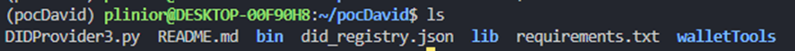
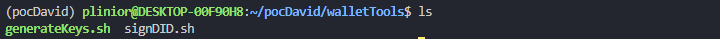
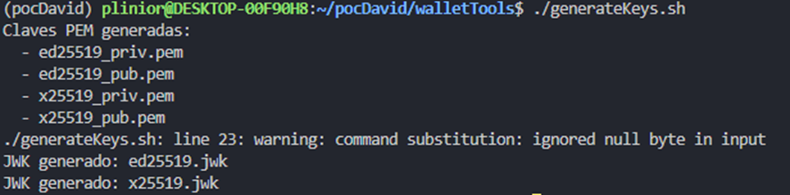
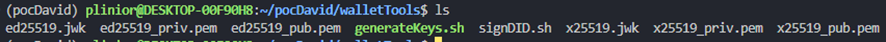

### Upgrade Steps 

#### Main Document Structure


- **`DIDProvider3.py`**: You must paste all the code provided for the backend.
- **`README.md`**: Update this file with instructions based on the code's functionality.
- **`bin` and `lib`**: These are the virtual environment directories where the backend runs (they do not require manual modification).
- **`requirements.txt`**: List of dependencies required for installation (run `pip install -r requirements.txt`).
- **`walletTools`**: Folder containing the key management scripts.

#### Initial structure of the `walletTools` folder


- **`generateKeys.sh`**: Paste the complete code for the key generation script here.
- **`signDID.sh`**: Paste the complete code for the DID signing script here.

#### Final Post-Execution Files

Sigue estos pasos para generar la estructura final:  

1. **Navigate to the correct folder**:  
   ```bash
   cd pocDavid/walletTools
   ```  
2. **Grant execute permissions** (only once):  
   ```bash
   chmod +x generateKeys.sh
   ```  
3. **Run the script**:
   ```bash
   ./generateKeys.sh
   ```  

#### Expected Output:


- The following files will be generated in `walletTools`:
- Public/private keys (e.g., `key_public.pem`, `key_private.pem`).
- Signature files (e.g., `did_signed.json`). 

#### Verificación:  


- Use `ls` to confirm that the files were created:
  ```bash
  ls -l
  ```  
